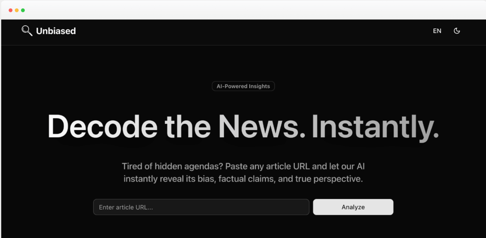

# Unbias: Article Analysis Tool

[](https://nextjs.org/)
[](https://www.typescriptlang.org/)
[](https://tailwindcss.com/)
[](https://nodejs.org/)
[](https://expressjs.com/)
[](https://supabase.io/)
[](https://opensource.org/licenses/MIT)
[](https://unbiased.adriancares.com)

A web application that analyzes online articles for bias, factual claims, and perspective using AI.



## Project Overview

Unbias allows users to submit a URL of an online article. The backend fetches the article's content, analyzes it using OpenAI's language models for factual claims, bias, and perspective ("slant"), and displays the results. The system handles concurrent requests reliably using a background job queue and provides real-time status updates.

**Key Features Include:**

*   🤖 **AI-Driven Analysis:** Provides detailed insights into online articles covering bias, factual claims, and overall perspective using advanced language models.
*   ⏱️ **Real-Time Status Updates:** Keeps users informed about the analysis progress from submission through fetching, processing, and completion via WebSockets.
*   🌐 **Multi-Language Support:** Offers both the user interface and the generated analysis content in English and German.
*   🗂️ **Analysis History:** Maintains a list of recently analyzed articles, persisted in the user's local browser storage for easy access and review of past results.
*   🛡️ **Strategic Content Fetching:** Employs Archive.is for a predefined list of major publications (often paywalled) to ensure reliable content retrieval for analysis.
*   🔗 **Shareable Analysis Links:** Users can copy and share unique URLs for completed analyses, allowing anyone to view the results without needing to re-analyze.
*   🔒 **Cloudflare Turnstile Integration:** Implements robust bot protection with a seamless human verification flow that adapts to the site's theme and persists verification across language changes.
*   ⚙️ **Efficient Analysis Reuse:** (Configurable via an environment variable) The system intelligently checks if an article (based on its normalized URL and requested language) has already been analyzed and, if so, serves the existing results to save processing time and costs.
*   💾 **Optimized Database Storage:** Essential article content such as the title, main text (for LLM analysis), and preview image URL are stored in dedicated database columns, while bulky HTML is discarded, significantly reducing storage requirements.

## Data Flow & Analysis Process

1.  **User Submission:**
    *   User submits an article URL and preferred language (EN/DE) via the Frontend.
    *   **Turnstile Verification:** User completes the Cloudflare Turnstile challenge to verify they are human.
    *   Frontend sends the URL, language, and Turnstile token to the Backend API (`POST /api/submit`).
2.  **Backend API (`/api/submit`):**
    *   Validates the input and **verifies the Turnstile token with Cloudflare** before proceeding.
    *   **URL Normalization:** Normalizes the submitted URL (e.g., converts to HTTPS, removes `www.`, strips tracking parameters).
    *   **Analysis Reuse Check (if `REUSE_EXISTING_ANALYSIS` is enabled):**
        *   Queries the Database for an existing 'Complete' job matching the normalized URL and language.
        *   If a match is found:
            *   Retrieves the existing job's `jobId`, optimized article data (title, author, image URL, etc.), and `analysis_results`.
            *   Returns `200 OK` with this full data payload directly to the Frontend. The Frontend then displays this existing analysis immediately.
        *   If no match (or feature disabled, or language differs): Proceeds to new job creation.
    *   **New Job Creation:**
        *   Creates a new job record in the Database (Supabase) with status 'Queued', storing the original URL, language, and `normalized_url`.
        *   Adds the job (containing `jobId`, original `url`, and `language`) to the Job Queue (BullMQ).
        *   Returns `202 Accepted` with the new `jobId` to the Frontend.
3.  **Frontend (for New Job):**
    *   Receives the new `jobId`.
    *   Updates its state (e.g., `jobStatus` to 'Queued', `isLoading` to true) via Zustand.
    *   Subscribes to WebSocket events for this `jobId`.
    *   May periodically poll `GET /api/status/:jobId` for fallback updates or initial preview data.
4.  **Backend Worker:**
    *   Picks up the job from the `analysis-queue`.
    *   Updates job status to 'Processing', then 'Fetching' (updates DB, emits WebSocket update via Redis Pub/Sub).
    *   Fetches article content using Diffbot API (utilizing Archive.is for specified domains).
    *   **Parses Diffbot Output & Stores Optimized Data:**
        *   Extracts `article_title`, `article_text` (main content for LLM), `article_author`, `article_source_name`, `article_canonical_url`, `article_preview_image_url` (selected best image), and `article_publication_date`.
        *   Stores these in their new dedicated columns in the `jobs` table.
        *   Stores other minimal, non-bulky Diffbot metadata into the `job_details` JSONB column (full HTML is no longer stored here).
    *   Updates job status to 'Analyzing' (DB + WebSocket).
    *   Retrieves `article_title` and `article_text` from the database.
    *   Sends these to OpenAI API for analysis.
    *   Stores `analysis_results` (slant, claims, bias report) from OpenAI in the DB.
    *   Updates job status to 'Complete' (DB + WebSocket, including `analysis_results`).
    *   If any step fails, updates job status to 'Failed' with an error message.
5.  **Frontend (Receiving Updates/Results):**
    *   Receives `jobUpdate` events (status changes, final results if 'Complete', or error if 'Failed').
    *   Updates UI accordingly.
    *   For 'Complete' status:
        *   Displays the full analysis.
        *   Shows the "Share this analysis" UI element with a copyable link.
        *   Adds the item to local history.
6.  **Viewing a Shared Analysis:**
    *   User opens a shared link (e.g., `https://unbiased.adriancares.com/[locale]/analysis/{jobId}`).
    *   The Frontend page for this route fetches data from `GET /api/status/{jobId}`.
    *   The API returns the optimized article data and analysis results for the specified `jobId`.
    *   Frontend renders the article preview and analysis. UI is in the `locale` from the URL; analysis content is in its original stored language.
    *   If `jobId` is invalid/failed, an error page is shown.

```mermaid
graph LR
    User_New["User (New Submission)"] -->|"URL, Lang"| FE["Next.js Frontend"]
    User_Shared["User (Shared Link)"] -->|"/analysis/:jobId"| FE

    FE -->|"Turnstile Verification"| FE
    FE -->|"POST /api/submit (URL, Lang, Turnstile Token)"| API["Backend API Server"]
    FE -->|"GET /api/status/:jobId (for Shared/Status)"| API
    FE -->|"WebSocket"| API

    subgraph "Backend System"
        API -->|"Verify Turnstile Token"| CF["Cloudflare Turnstile"]
        CF -->|"Verification Result"| API
        API -->|"Normalized URL, Lang"| DB["Supabase DB (Jobs Table)"]
        DB -->|"Existing Analysis?"| API

        API -->|"Check Reuse"| Decision{{"Reuse Enabled & Match Found?"}}
        Decision -->|"Yes (200 OK, Full Analysis Data)"| FE
        Decision -->|"No (No Match or Reuse Disabled)"| CreateJob["Create Job (Normalized URL)"]
        CreateJob --> DB
        DB -->|"New Job ID"| API
        API -->|"Add to Queue"| Q["BullMQ Queue (Redis)"]
        API -->|"202 Accepted (New Job ID)"| FE

        Q -->|"Job"| Worker["Background Worker"]
        Worker -->|"Fetch/Parse (Diffbot, Archive.is)"| ExtService["External Services: Diffbot"]
        Worker -->|"Store Optimized Article Data (New Columns + Min. job_details)"| DB
        Worker -->|"Get Title/Text for LLM"| DB
        DB -->|"Title/Text"| Worker
        Worker -->|"Analyze (OpenAI)"| ExtService_AI["External Services: OpenAI"]
        Worker -->|"Store Analysis Results"| DB
        Worker -->|"Status Updates"| RedisPubSub["Redis Pub/Sub"]
        RedisPubSub -->|"Job Updates"| API
    end

    API -->|"WebSocket Updates"| FE

    style User_New fill:#cde,stroke:#333
    style User_Shared fill:#cde,stroke:#333
    style FE fill:#lightcyan,stroke:#333
    style API fill:#honeydew,stroke:#333
    style Q fill:#peachpuff,stroke:#333
    style Worker fill:#lavenderblush,stroke:#333
    style DB fill:#lightblue,stroke:#333
    style ExtService fill:#whitesmoke,stroke:#333
    style ExtService_AI fill:#whitesmoke,stroke:#333
    style RedisPubSub fill:#mistyrose,stroke:#333
    style CF fill:#f0f8ff,stroke:#333
    style Decision fill:#f0fff0,stroke:#333
```



## Architecture

The application follows a distributed core architecture:

-   **Frontend**: Next.js application (Zustand for state). Handles UI, URL submission, Turnstile verification, real-time status display, results viewing, history, and **displaying shared analyses via a new route (`/analysis/[jobId]`)**.
-   **Backend API**: Node.js/Express.js server. Handles API requests (including **Turnstile verification and logic for analysis reuse in `/api/submit`**), WebSocket management (Socket.IO + Redis Pub/Sub), DB interaction, and job queuing. The `/api/status/:jobId` endpoint is enhanced to serve data for shared links.
-   **Background Worker**: Node.js process. Listens to BullMQ, performs analysis (Diffbot -> OpenAI), **parses Diffbot output to store optimized data in new dedicated DB columns and minimal `job_details`**, updates DB, and emits status updates.
-   **Database**: Supabase (PostgreSQL). Stores job info, status, **optimized article data (`article_title`, `article_text`, `article_preview_image_url`, etc. in dedicated columns), `normalized_url` for reuse checks, minimal `job_details` (other Diffbot metadata)**, `analysis_results`, and errors.
-   **Job Queue**: BullMQ (Redis) for asynchronous analysis.
-   **Real-time Communication**: WebSockets (Socket.IO + Redis Pub/Sub).
-   **Security**: Cloudflare Turnstile for bot protection, with seamless user experience.
-   **Configuration Management**: Environment variables validated at startup. New `REUSE_EXISTING_ANALYSIS` variable to toggle analysis reuse.

## Prerequisites

-   Node.js (v20.x LTS)
-   npm (v10.x)
-   Supabase Account (Project URL and Service Key)
-   OpenAI API Key
-   Diffbot API Token
-   Cloudflare Turnstile Account (Site Key and Secret Key)
-   Redis instance

## Project Structure

```
unbias/
├── backend/              # Node.js/Express.js backend
│   ├── src/
│   │   ├── api/          # API routes (submit with Turnstile verification, status, results, history, image-proxy)
│   │   ├── config/       # Configuration (env validation, app config incl. reuse toggle)
│   │   ├── db/           # Supabase client, jobsRepository (handles new cols, normalized_url)
│   │   ├── lib/          # Core libraries (Diffbot, OpenAI, Redis, Sockets, utils incl. URL normalization, logger)
│   │   ├── queues/       # BullMQ queue setup
│   │   ├── scripts/      # Migration scripts (e.g., for DB optimization)
│   │   ├── types/        # TypeScript type definitions (updated for new DB fields)
│   │   └── workers/      # analysisWorker.ts (logic for optimized data saving)
│   ├── .env.example      # Example environment variables (incl. REUSE_EXISTING_ANALYSIS, CLOUDFLARE_TURNSTILE_SECRET_KEY)
│   └── package.json
├── frontend/             # Next.js frontend
│   ├── src/
│   │   ├── app/
│   │   │   └── [locale]/
│   │   │       ├── analysis/
│   │   │       │   └── [jobId]/
│   │   │       │       └── page.tsx  # New: Page for displaying shared analyses
│   │   │       └── page.tsx          # Main page
│   │   ├── components/   
│   │   │   ├── TurnstileWidget.tsx # Cloudflare Turnstile integration
│   │   │   ├── ShareableLink.tsx   # Shareable link component
│   │   │   └── ...                 # Other React components
│   │   ├── lib/          # Core libraries (apiClient, socketClient, store updated for reuse/sharing)
│   │   └── ...
│   └── ...
├── LOGGING.md
└── README.md             # This file
```

## Getting Started

### Backend Setup

1.  `cd backend`
2.  `npm install`
3.  Create `.env` from `.env.example`, fill credentials.
    *   **Required:** Set `CLOUDFLARE_TURNSTILE_SECRET_KEY` for bot protection.
    *   **Optional:** Consider setting `REUSE_EXISTING_ANALYSIS=true` or `false`.
4.  Run Supabase migrations if setting up the DB for the first time or after schema changes (e.g., for optimized columns, `normalized_url`).
5.  `npm run dev`

### Frontend Setup

1.  `cd frontend`
2.  `npm install`
3.  Create `.env.local` from `.env.local.example` with:
    * Backend URLs
    * `NEXT_PUBLIC_CLOUDFLARE_TURNSTILE_SITE_KEY` for the Turnstile widget
4.  `npm run dev` (Access at `http://localhost:3000`)

For more detailed frontend setup instructions, environment variables, and component information, please refer to the [Frontend README](./frontend/README.md).


## API Endpoints

-   `POST /api/submit`: Submit a URL for analysis.
    -   Body: `{ "url": "string", "language"?: "en" | "de", "cf-turnstile-response": "string" }`
    -   Response (202 Accepted): `{ "jobId": "string (new job)" }`
    -   **Response (200 OK - if reuse enabled & match found):** `{ "existingAnalysis": true, "jobId": "string", "language": "string", "url": "string", "article_title": "string|null", ..., "analysis_results": {} }`
-   `GET /api/status/:jobId`: Get status and data for a job. **Serves full data for 'Complete' jobs to support sharing.**
    -   Response (200 OK): Job object including `status`, all optimized article fields (e.g., `article_title`, `article_preview_image_url`), `analysis_results` (if complete), `normalized_url`.
-   `GET /api/results/:jobId`: (As before, preferred for completed job results).
-   `GET /api/image-proxy`: (As before).
-   `GET /api/history`: (As before, but `headline` and `article_preview_image_url` now sourced from new/optimized columns with fallback).
-   `GET /api/health`: (As before).
-   `GET /api/debug/:jobId`: (As before).

## WebSocket Events

(No changes to event names or structures from this update, but the data flow leading to `jobUpdate` for 'Complete' might be short-circuited by the reuse feature).

## Technologies Used

-   **TypeScript**: Programming language for frontend and backend (v5.x).
-   **Next.js / React**: Frontend framework (Next.js v15.3.1, React v18.3.1).
-   **Zustand**: Frontend state management (v5.x).
-   **Node.js / Express.js**: Backend framework (Node.js v20.x, Express.js v4.x).
-   **PostgreSQL (Supabase)**: Database for job storage.
-   **Redis**: In-memory data store for BullMQ and WebSocket Pub/Sub.
-   **BullMQ**: Job queue library for managing asynchronous analysis tasks (v5.x).
-   **Socket.IO**: Real-time bidirectional event-based communication (WebSockets v4.x).
-   **OpenAI API**: For AI-powered text analysis (SDK v4.x, Model e.g., gpt-4o).
-   **Diffbot API**: For robust article content extraction.
-   **Cloudflare Turnstile**: Bot protection service with seamless user experience.
-   **Tailwind CSS**: Utility-first CSS framework for the frontend (v4.x).
-   **Shadcn/ui**: UI components for the frontend.
-   **Vitest**: Unit and component testing (Backend v1.x, Frontend v3.x).
-   **Axios**: HTTP client (v1.x).
-   **Sharp**: Image processing (v0.3x).
-   **next-intl**: Internationalization for Next.js (v3.x).

## Logging System

A flexible, environment-aware logging system is implemented for both frontend and backend. It supports multiple log levels (`error`, `warn`, `info`, `debug`, `trace`) controllable via environment variables (`LOG_LEVEL` for backend, `NEXT_PUBLIC_LOG_LEVEL` for frontend) and browser `localStorage`. For detailed information, refer to `LOGGING.md`.

## Frontend State Management

The frontend uses **Zustand** for global state management. This includes:
-   Current job ID, status, and analysis data.
-   Error messages.
-   Loading states.
-   History of analyzed articles, which is also persisted to **localStorage** for continuity between sessions.
The store module (`frontend/src/lib/store.ts`) centralizes logic for API calls, WebSocket interactions, and state updates.

## Content Fetching Strategy

To handle paywalls and improve content extraction reliability for certain domains (e.g., major news publications), the backend's `diffbotClient.ts` implements a proactive archiving strategy. For domains listed in `backend/src/config/index.ts` (`proactiveArchiveDomains`), it attempts to fetch content via `Archive.is` before sending the URL to Diffbot. This is recorded in the `job_details` under `fetchStrategy` and `isArchiveContent`.

## License

This project is licensed under the **[MIT License](./LICENSE)**.
