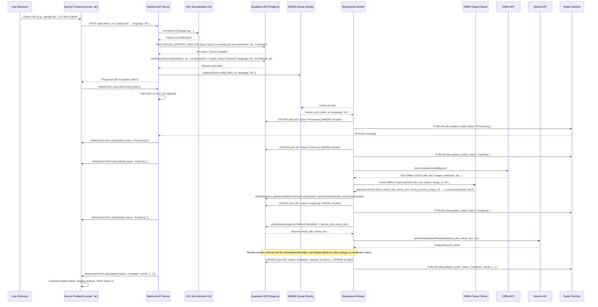
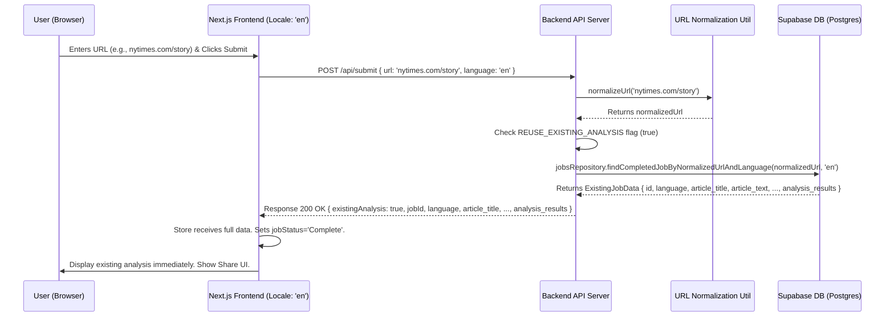
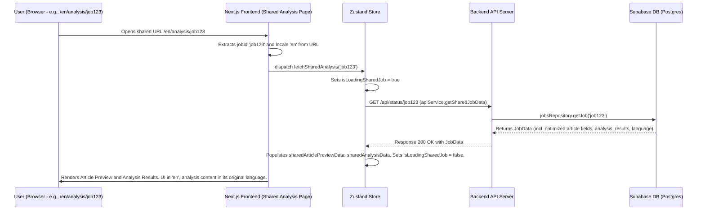

# Architecture for Unbiased: Article Analysis Tool

**Status:** Updated (Reflecting PRD v1.4 Requirements - Sharing, Reuse, DB Optimization)

## Technical Summary

This document details the technical architecture for Unbiased, an application designed to analyze online articles for bias, factual claims, and perspective using AI. The system employs a decoupled architecture featuring a Next.js frontend (using Zustand for state management), a Node.js backend (API Server and separate Worker process), Supabase for PostgreSQL database storage, Redis for job queuing via BullMQ, and WebSockets (Socket.IO) for real-time updates.

Key enhancements in this version include:
1.  **Sharing Option:** Users can share completed analyses via unique, publicly accessible URLs (e.g., `/analysis/{jobId}`).
2.  **Analysis Reuse:** The system can (if enabled via an environment variable `REUSE_EXISTING_ANALYSIS`) check for previously completed analyses based on a normalized URL and language. If a match is found, the existing analysis is served directly, reducing redundant LLM calls.
3.  **Database Optimization:** Article content storage in the database is optimized. Instead of storing full HTML from Diffbot, essential fields like `article_title`, `article_text` (for LLM), `article_preview_image_url`, and other key metadata are stored in dedicated columns. The `job_details` JSONB column now stores only other minimal, non-bulky metadata from Diffbot.

The design prioritizes reliability, responsiveness, and efficiency through asynchronous job processing, strategic content fetching (including a proactive Archive.is strategy for specified domains), and intelligent reuse of existing data. User requests are either served directly (if a reusable analysis is found) or immediately queued. Real-time feedback for new analyses is provided via WebSockets. Multi-language support (EN/DE) is integrated. For security and optimized performance, external images from article content are proxied. The architecture supports maintainability and testability through clear component separation, TypeScript, defined standards, and mandated unit testing.

## Technology Table

| Category             | Technology Choice              | Version (From Code) | Description                                                                                               | Rationale / Notes                                                                      |
| :------------------- | :----------------------------- | :------------------ | :-------------------------------------------------------------------------------------------------------- | :------------------------------------------------------------------------------------- |
| Language             | TypeScript                     | `~5.x`              | Superset of JavaScript adding static typing.                                                              | Improves code quality, maintainability. Used in FE & BE.                               |
| Frontend Framework   | Next.js / React                | `15.3.x` / `18.3.x` | Framework for building React apps. App Router used.                                                         | Powerful features, aligns with React preference.                                        |
| Backend Framework    | Node.js / Express.js           | `~20.x` / `~4.x`    | Runtime env & web framework for backend API.                                                              | Mature, well-supported, handles async I/O well.                                        |
| Database             | PostgreSQL (via Supabase)      | `15.x+`             | Relational DB for job/result/language/optimized article content storage. New `normalized_url` column.     | Robust, standard SQL DB. Provided by Supabase. Supports new optimized columns.          |
| DB Client (Backend)  | `@supabase/supabase-js`        | `~2.x`              | Official Supabase client library.                                                                           | Simplifies DB interactions.                                                            |
| Job Queue System     | BullMQ                         | `~5.x`              | Robust Node.js library for managing background jobs via Redis.                                              | Provides persistence, retries, scalability.                                            |
| Job Queue Backend    | Redis                          | `6.x / 7.x`         | In-memory data store used by BullMQ.                                                                      | Fast, industry standard. Assumed hosted (e.g., Coolify).                               |
| Redis Client (Node)  | `ioredis`                      | `~5.x`              | High-performance Redis client used by BullMQ.                                                               | Required dependency for BullMQ.                                                        |
| Real-time Comm.      | Socket.IO                      | `~4.x`              | Library for enabling real-time WebSocket communication.                                                     | Used for Frontend <-> API Server updates.                                               |
| State Management (FE)| Zustand                        | `~5.x`              | Minimalist state management library.                                                                        | Identified in `frontend/src/lib/store.ts`. Handles shared/reused analysis state.      |
| Content Extraction   | Diffbot API                    | `v3`                | External service for extracting article content. Worker uses proactive Archive.is strategy.               | Specified requirement. Output now parsed for specific fields.                         |
| AI Analysis          | OpenAI API                     | `v2` (SDK `~4.x`)   | External service for LLM-based analysis. Model `gpt-4o`.                                                  | Specified requirement. Uses `article_title` and `article_text` from DB.                 |
| OpenAI Client        | `openai` (Node SDK)            | `~4.x`              | Official Node.js library for OpenAI API.                                                                    | Preferred over raw HTTP calls.                                                         |
| HTTP Client          | Axios                          | `~1.x`              | Promise-based HTTP client.                                                                                  | Used in Backend (Diffbot) & Frontend (API).                                            |
| Image Processing     | Sharp                          | `~0.32.x`           | High-performance Node.js image processing library.                                                          | Used for optimizing proxied images. Resizes and converts to WebP.                       |
| Styling (Frontend)   | Tailwind CSS                   | `~4.x`              | Utility-first CSS framework.                                                                                | Configured with PostCSS.                                                               |
| UI Components (FE)   | shadcn/ui (via Radix UI)       | Various             | Primitives & styled components (`Accordion`, `Label`, `Tooltip` etc).                                     | Core UI building blocks identified in code.                                             |
| Validation (FE)      | Zod / react-hook-form          | `~3.x` / `~7.x`     | Schema validation & form handling.                                                                          | Used in `UrlInput` component.                                                          |
| Utility Libraries    | clsx, tailwind-merge, date-fns | Various             | CSS class merging, date formatting.                                                                         | Common frontend utilities identified.                                                  |
| Icons (FE)           | Lucide Icons                   | `~0.5x`             | Icon library.                                                                                               | Identified in `frontend/package.json` & components.                                      |
| i18n Library (FE)    | `next-intl`                    | `~3.x`              | Internationalization library for Next.js App Router.                                                        | Implemented for English/German UI translation.                                          |
| Testing (Unit)       | Vitest                         | `~3.1.x`            | Fast unit testing framework.                                                                                | Configured for Frontend & Backend. Test file location/naming conventions defined.      |
| Testing (Frontend Lib)| React Testing Library          | `~14.x`             | Library for testing React components user-centrically.                                                      | Used with Vitest for Frontend tests.                                                   |
| Package Manager      | npm                            | `10.x+`             | Node Package Manager.                                                                                       | Standard choice based on `package.json`.                                               |
| Code Formatter       | Prettier                       | (Assumed)           | Opinionated code formatter.                                                                                 | Standard practice, assumed setup.                                                      |
| Linter               | ESLint                         | `~9.x`              | Pluggable linter.                                                                                           | Configured in Frontend. Backend uses `tsc --noEmit`.                                 |
| Dev Server (Backend) | `nodemon` / `ts-node`          | `~3.x` / `~10.x`    | For running backend in development with auto-reload.                                                        | Defined in `backend/package.json`.                                                   |
| Concurrency (Backend)| `concurrently`                 | `~8.x`              | For running API and Worker simultaneously in dev.                                                           | Defined in `backend/package.json`.                                                   |
| Environment Variable | `REUSE_EXISTING_ANALYSIS`      | N/A                 | Toggles the analysis reuse feature.                                                                         | New. Defaults to `false`.                                                              |

## High-Level Overview

The system follows a **Distributed Core** architecture style. It separates concerns into a dynamic Frontend Application (Next.js), a stateless Backend API Server (Express), and stateful Background Worker processes (Node.js). Communication occurs via REST API, WebSockets (Socket.IO), and a Job Queue (BullMQ/Redis).

**New Feature Impacts:**
*   **Sharing:** A new frontend route (`/analysis/[jobId]`) allows direct viewing of completed analyses. The backend's `/api/status/:jobId` endpoint serves data for these shared links.
*   **Analysis Reuse:** The `/api/submit` endpoint now includes logic to check (if `REUSE_EXISTING_ANALYSIS` is true) for existing completed analyses based on a normalized URL and language. If found, it returns the full analysis data directly. Otherwise, it proceeds with new job creation.
*   **Database Optimization:** The `jobs` table now includes dedicated columns for essential article data (`article_title`, `article_text`, `article_preview_image_url`, etc.), reducing reliance on a large `job_details` JSONB object for core content.

Content fetching uses a proactive Archive.is strategy for specified domains. Analysis results include backend-generated dimension statuses, and language support (EN/DE) is integrated.

```mermaid
graph TD
    A[User Browser (New Submission)] -- HTTPS --> B(Next.js Frontend @ Coolify/Vercel);
    A_Shared[User Browser (Shared Link)] -- HTTPS --> B;

    subgraph "Backend System"
        B -- REST API (/api/submit - incl. lang pref) --> C{Backend API Server (Node.js/Express @ Coolify)};
        B -- REST API (/api/status/:jobId - for shared links & status) --> C;
        B -- WebSocket (WSS) --> C;

        C -- Check for Existing Analysis (URL, Lang) --> E[Supabase Postgres DB (External)];
        alt Reuse Enabled & Match Found
            C -- Returns Full Analysis Data (200 OK) --> B;
        else No Match or Reuse Disabled
            C -- Add Job (incl. lang, normalized_url) --> D[BullMQ Queue];
            C -- Returns New Job ID (202 Accepted) --> B;
        end
        C -- Read History / Status --> E;
        C -- Subscribes --> F[Redis Pub/Sub @ Coolify];

        D -- Uses --> G((Redis @ Coolify));
        F -- Uses --> G;

        H(Background Worker (Node.js @ Coolify)) -- Listens --> D;
        H -- Read Job Data (url, lang) --> E;
        H -- Write Optimized Article Data & Min. job_details --> E;
        H -- Write Analysis Results --> E;
        H -- Publish Update --> F;
        H -- Checks Domain, Selects URL --> H;
        H -- HTTP (Archive.is or Original URL) --> I(Diffbot API);
        H -- HTTP (article_title, article_text, lang instruction) --> J(OpenAI API);
    end

    style G fill:#f9f,stroke:#333,stroke-width:2px
    style E fill:#ccf,stroke:#333,stroke-width:2px
    style I fill:#f8d7da,stroke:#721c24
    style J fill:#d1ecf1,stroke:#0c5460
```
*Diagram: C4 Context/Container Level Hybrid (Updated for Sharing, Reuse, DB Optimization)*

### Component View

*   **Next.js Frontend:**
    *   Renders UI (React/shadcn/ui), manages UI state (Zustand), handles user input.
    *   **New Route:** `app/[locale]/analysis/[jobId]/page.tsx` for displaying shared analyses (client-side data fetching).
    *   **Zustand Store:** Logic updated to handle direct data return from `/api/submit` for reused analyses. Actions for fetching shared analysis data.
    *   **UI:** New "Copy Link" UI for completed analyses.
    *   Communicates with backend (Axios, Socket.IO client). Translates backend English labels.
*   **Backend API Server (Express.js):**
    *   Handles HTTP requests.
    *   **`/api/submit`:**
        *   Includes URL normalization logic.
        *   If `REUSE_EXISTING_ANALYSIS` is true, checks DB for existing completed analysis (normalized URL, language).
        *   If match found, returns `200 OK` with full analysis data.
        *   Otherwise, creates job in DB (with `language`, `normalized_url`), adds to queue, returns `202 Accepted` with `jobId`.
    *   **`/api/status/:jobId`:** Serves job status. For 'Complete' jobs, returns all necessary data for shared link display (from new optimized columns with fallback to old `job_details`). Publicly accessible for completed jobs.
    *   Manages WebSocket connections/rooms, relays status updates. Stateless.
*   **Background Worker (Node.js):**
    *   Listens to BullMQ queue. Retrieves job data.
    *   Determines fetch URL (original or Archive.is). Calls Diffbot.
    *   **Parses Diffbot output:** Extracts `title`, `text`, `author`, `sourceName`, `canonicalUrl`, `previewImageUrl`, `publicationDate`. Selects best preview image. Creates minimal JSON for other metadata.
    *   **Saves to DB:** Stores extracted fields in dedicated columns, minimal JSON in `job_details`.
    *   Retrieves `article_title` and `article_text` from DB to pass to OpenAI.
    *   Calls OpenAI with content and `language` parameter. Parses results. Updates job status/results in DB. Publishes status updates.
*   **Supabase Postgres DB:**
    *   `jobs` table: Includes new columns `normalized_url TEXT`, `article_title TEXT`, `article_text TEXT`, `article_author TEXT`, `article_source_name VARCHAR(255)`, `article_canonical_url VARCHAR(2048)`, `article_preview_image_url VARCHAR(2048)`, `article_publication_date TIMESTAMPTZ`. `job_details JSONB` now stores minimal other metadata.
*   **Redis (Coolify Hosted):** Backend for BullMQ job queue and Pub/Sub.
*   **Socket.IO Manager (within API Server):** Manages WebSocket connections.
*   **URL Normalization Utility (`backend/src/lib/utils.ts`):** New utility for normalizing URLs.

```mermaid
graph TD
    subgraph Frontend
        A[UI Components (React/shadcn)]
        B[State Management (Zustand)]
        C[API Client (Axios)]
        D[WebSocket Client (Socket.IO)]
        AA[i18n Logic (next-intl)]
        NewSharedPageRoute[Shared Analysis Page Component (/analysis/[jobId])]

        A --> B; A --> AA;
        B --> C; B --> D; B --> AA;
        C --> E; D --> G;
        NewSharedPageRoute -- Uses --> B; NewSharedPageRoute -- Uses --> C;
    end

    subgraph Backend API Server
        E[Express Router/Middleware]
        F[API Controllers]
        F_Submit["/submit (handles reuse logic, URL norm.)"] --> F;
        F_Status["/status/:jobId (serves shared data)"] --> F;
        F_History["/history"] --> F;
        G[Socket.IO Server/Manager]
        H[BullMQ Client (Add Jobs)]
        I[Supabase Client (JobsRepository - Read/Write optimized data)]
        J[Redis Pub/Sub Subscriber] --> G
        UrlNormUtil[URL Normalization Utility]
    end

    subgraph Backend Worker Process
        K[BullMQ Worker Listener]
        L[Job Processing Logic]
        DiffbotParser[Diffbot Output Parser for Optimized Fields]
        M[Supabase Client (JobsRepository - Write optimized data, Read title/text for LLM)]
        N[Axios Client (Diffbot)]
        O[OpenAI Client (Analysis - uses article_title, article_text)]
        P[Redis Pub/Sub Publisher] --> J
        Q[Archive.is URL Strategy Logic]
    end

    F_Submit -- Uses --> UrlNormUtil; F_Submit -- Uses --> I; F_Submit -- Uses --> H;
    F_Status -- Uses --> I;
    F_History -- Uses --> I;
    E --> F;
    G --> F;

    K --> L;
    L --> Q; L --> N;
    N -- Diffbot Output --> DiffbotParser;
    DiffbotParser -- Parsed Data --> L;
    L -- Optimized Data --> M;
    L -- article_title, article_text (from DB) --> O;
    L -- Publishes Updates --> P;

    style Frontend fill:#lightblue
    style "Backend API Server" fill:#lightgreen
    style "Backend Worker Process" fill:#lightcoral
```
*Diagram: Simplified Component Interaction (Updated for Sharing, Reuse, DB Optimization)*

## Architectural Diagrams, Data Models, Schemas

### Architectural Sequence Diagram: Successful Analysis Request (New Submission, Reuse Disabled or No Match)



### Architectural Sequence Diagram: Submitting a URL (Analysis Reuse Case)



### Architectural Sequence Diagram: Viewing a Shared Analysis



### Data Model (Supabase/Postgres)

*   **Table:** `jobs`
    ```sql
    -- Enum type for job status (no change)
    -- CREATE TYPE job_status AS ENUM ('Queued', 'Processing', 'Fetching', 'Analyzing', 'Complete', 'Failed');

    -- Main jobs table (Updated)
    CREATE TABLE public.jobs (
      id uuid PRIMARY KEY DEFAULT gen_random_uuid(),
      url text NOT NULL,                                          -- Original submitted URL
      normalized_url text NULLABLE,                               -- New: Normalized URL for duplicate checks
      status job_status NOT NULL DEFAULT 'Queued',
      language VARCHAR(2) NOT NULL DEFAULT 'en',
      
      -- Optimized Article Content Columns (New)
      article_title TEXT NULLABLE,
      article_text TEXT NULLABLE,                                 -- Main text content for LLM analysis
      article_author TEXT NULLABLE,
      article_source_name VARCHAR(255) NULLABLE,
      article_canonical_url VARCHAR(2048) NULLABLE,               -- Canonical URL from Diffbot if available
      article_preview_image_url VARCHAR(2048) NULLABLE,           -- Selected preview image URL (proxied)
      article_publication_date TIMESTAMPTZ NULLABLE,

      job_details jsonb NULL,                                     -- Refined: Stores *minimal* other Diffbot metadata (e.g., tags, type), excludes full HTML and main text.
      analysis_results jsonb NULL,                                -- Stores OpenAI output (structure unchanged)
      error_message text NULL,
      created_at timestamptz NOT NULL DEFAULT now(),
      updated_at timestamptz NOT NULL DEFAULT now()
    );

    -- Existing Index (no change)
    -- CREATE INDEX idx_jobs_status_created_at ON public.jobs (status, created_at DESC);

    -- New Index for Analysis Reuse Feature
    CREATE INDEX idx_jobs_normalized_url_language_status ON public.jobs (normalized_url, language, status);

    -- Trigger to automatically update updated_at timestamp (no change)
    -- CREATE OR REPLACE FUNCTION trigger_set_timestamp()...
    -- CREATE TRIGGER set_timestamp_jobs...

    -- RLS (Row Level Security) - Assumed disabled for backend access.
    ```

### API Specification (Updated for v1.4 Features)

Referenced base path: `/api`

*   **`POST /submit`**
    *   **Description:** Submits a new URL for analysis. If `REUSE_EXISTING_ANALYSIS` is enabled and a matching completed analysis exists, returns that analysis directly. Otherwise, queues a new analysis job.
    *   **Request Body:** `application/json`
        ```json
        {
          "url": "string (Valid HTTP/HTTPS URL)",
          "language": "string ('en' or 'de', optional, defaults to 'en')"
        }
        ```
    *   **Response Success (202 Accepted - New Job Queued):** `application/json`
        ```json
        { "jobId": "string (UUID for new job)" }
        ```
    *   **Response Success (200 OK - Existing Analysis Reused):** `application/json`
        ```json
        {
          "existingAnalysis": true,
          "jobId": "string (UUID of existing job)",
          "language": "string ('en' or 'de')",
          "url": "string (Original URL of existing job)",
          // Optimized article data fields:
          "article_title": "string | null",
          "article_text": "string | null", // May be omitted in this response if very large, frontend can fetch if needed.
          "article_author": "string | null",
          "article_source_name": "string | null",
          "article_canonical_url": "string | null",
          "article_preview_image_url": "string | null",
          "article_publication_date": "string (ISO 8601 Timestamp) | null",
          // Full analysis results:
          "analysis_results": { /* Identical to analysis_results in /status/:jobId */ }
        }
        ```
    *   **Response Error (400 Bad Request):** (e.g., Invalid URL or Language)
    *   **Response Error (500 Internal Server Error):** (e.g., DB/Queue error during new job creation)

*   **`GET /status/:jobId`**
    *   **Description:** Retrieves the current status and data for a specific job. Publicly accessible for 'Complete' jobs to support sharing.
    *   **Path Parameters:** `jobId` (string, UUID format)
    *   **Response Success (200 OK):** `application/json`
        ```json
        {
          "id": "string (UUID)",
          "url": "string (Original submitted URL)",
          "normalized_url": "string | null", // New
          "status": "string (Enum: 'Queued', ..., 'Failed')",
          "language": "string ('en' or 'de')",
          // Optimized article data fields (prioritized if available):
          "article_title": "string | null",
          "article_text": "string | null", // Might be large, consider if needed for all status calls or only for 'Complete'
          "article_author": "string | null",
          "article_source_name": "string | null",
          "article_canonical_url": "string | null",
          "article_preview_image_url": "string | null",
          "article_publication_date": "string (ISO 8601 Timestamp) | null",
          "job_details": { /* Minimal other Diffbot metadata, or old full structure for backward compatibility */ } | null,
          "analysis_results": { /* Full analysis object if status is 'Complete' */ } | null,
          "error_message": "string (English) | null",
          "created_at": "string (ISO 8601 Timestamp)",
          "updated_at": "string (ISO 8601 Timestamp)"
        }
        ```
        *Note on `job_details` vs. new columns:* For new records, `article_title` etc. are primary. For old records, API falls back to parsing `job_details` if new columns are NULL.*
    *   **Response Error (404 Not Found):**
    *   **Response Error (400 Bad Request):** (e.g., Invalid UUID)

*   **`GET /history`** (No direct change, but data source for `headline` etc. will use new columns with fallback)
*   **`GET /results/:jobId`** (No direct change, but data source for preview details within the "analysis" object will use new columns with fallback if necessary for consistency)
*   **`GET /image-proxy`** (No change)

### WebSocket Events (No change)

## Patterns and Standards

*   **Architectural/Design Patterns:**
    *   Job Queue (BullMQ), Repository Pattern (Simplified), Publish/Subscribe (Redis), Configuration Management (Env Vars + `proactiveArchiveDomains` config, `REUSE_EXISTING_ANALYSIS` env var).
    *   **URL Normalization:** A defined strategy for normalizing URLs before database storage and lookup (HTTPS, no `www.`, strip tracking params, lowercase domain, trailing slash).
*   **API Design Standards:**
    *   RESTful, JSON, `camelCase` keys, `kebab-case` URLs, UUIDs. `/api/submit` now has conditional 200 OK / 202 Accepted responses.
*   **Coding Standards:**
    *   TypeScript (`strict`), Style Guide (Consistent), Formatter (Prettier), Linter (ESLint/tsc).
    *   Naming (`camelCase.ts` files, etc.).
    *   **Unit Test File Location:** Unit tests are co-located with the source files they test, typically in a `__tests__` subdirectory (e.g., `src/lib/__tests__/utils.test.ts`) or alongside the file using a `.test.ts` or `.spec.ts` suffix (e.g., `src/lib/utils.ts` and `src/lib/utils.test.ts`). *This project appears to use the `__tests__` subdirectory convention for the backend and a mix for the frontend.* **Recommendation: Standardize on `__tests__` subdirectories for both frontend and backend for consistency if refactoring, or maintain current conventions if clearly understood by the team.**
    *   **Unit Test File Naming Convention:** Test files should be named `[filename].test.ts` or `[filename].spec.ts` (e.g., `utils.test.ts`).
    *   **General Guidance for AI Agent Implementation:** Keep code modular and interfaces clear. Avoid overly complex or "magic" code. Favor explicit dependencies. The standards defined here should be the minimum necessary; AI agents are generally capable of following common best practices.
*   **Error Handling Strategy:**
    *   Backend: `try...catch`, logging (`pino`), standardized API errors, Worker `JobProcessingError`.
    *   Frontend: `try...catch`, user-friendly messages, specific error handling for shared link page.
*   **Configuration Management:**
    *   Environment variables validated at startup. New `REUSE_EXISTING_ANALYSIS` environment variable.
*   **Localization Strategy:** (No change from this update)

## Testing Strategy

*   **Unit Tests:**
    *   **Framework:** Vitest.
    *   **Scope:** Mandatory for all core logic:
        *   Backend: API handlers (including new `/api/submit` logic), worker steps (Diffbot parsing, data saving to new columns), URL normalization utility, `jobsRepository` methods for new columns and duplicate checks.
        *   Frontend: Zustand store actions (especially `submitUrl` new logic, `fetchSharedAnalysis`), components rendering shared/reused data, "Copy Link" UI.
    *   **Location & Naming:** As per Coding Standards: `__tests__/[filename].test.ts` or `[filename].test.ts`.
*   **Integration Tests:**
    *   Recommended for:
        *   Full `/api/submit` flow (both new job and reuse job scenarios).
        *   Frontend shared analysis page data fetching and rendering.
        *   Worker processing from Diffbot fetch through OpenAI call to saving optimized data.
*   **End-to-End (E2E) Tests:**
    *   Recommended for:
        *   User submitting a URL that gets reused.
        *   User sharing an analysis and another user viewing it.
        *   Accessing an invalid/failed shared link.
*   **Data Migration Testing:** The script for migrating `job_details` to new columns must be thoroughly tested in a staging environment.

## Infrastructure and Deployment

*   **Cloud Accounts Needed:** (No change)
*   **Resources to Provision (via Coolify):** (No change)
*   **Resources to Provision (External/Other):** (No change)
*   **CI/CD Strategy:**
    *   (No change to core strategy)
    *   **New Consideration:** The CI/CD pipeline will need to handle database migrations (for adding new columns and the data migration script for Feature 3). This might involve adding a step to run migrations during deployment.
*   **Environment Variables:**
    *   New: `REUSE_EXISTING_ANALYSIS` (boolean, defaults to `false`). Backend services (API Server) need this.

## Glossary
*   **Normalized URL:** A URL that has undergone a standardization process (e.g., scheme to HTTPS, www removal, tracking parameter stripping, consistent casing, trailing slash removal) to ensure consistent representation for comparison and storage.
*   *(Other terms remain as previously defined)*

## Security

### Row Level Security (RLS) Implementation

The database employs Row Level Security (RLS) to protect sensitive data in the `jobs` table:

*   **Default Policy:** A default-deny policy is in place that blocks access to all rows unless another policy explicitly grants access.
*   **Anonymous Access:** Anonymous users (using the `anon` role) can only view jobs with a status of 'Complete'. This supports the sharing feature while preventing access to in-progress jobs.
*   **Backend Service Access:** The backend services use the `SERVICE_ROLE_KEY` which inherently bypasses RLS, allowing them to perform all necessary operations (SELECT, INSERT, UPDATE, DELETE) on the jobs table.
*   **API Access Control:** The API server enforces additional data access controls to ensure that only appropriate fields from completed jobs are exposed to anonymous users.

This multi-layered security approach provides defense-in-depth, ensuring that even if other security measures are bypassed, the database maintains an additional protective layer.

```sql
-- RLS Policies for the jobs table
-- Default-deny policy for all operations
CREATE POLICY "Default Deny" ON public.jobs FOR ALL USING (false);

-- Allow anonymous users to view only completed jobs
CREATE POLICY "Allow public read access to completed jobs" 
ON public.jobs 
FOR SELECT 
TO anon
USING (status = 'Complete'::job_status);
```

## POST MVP / PRD Features
*   Full data migration of all historical `job_details` to the new optimized column structure and minimal `job_details` format (if initial migration is partial or focuses only on 'Complete' jobs).
*   More sophisticated URL normalization (e.g., handling URL shorteners, more comprehensive tracking parameter lists).
*   Admin interface to manage the `REUSE_EXISTING_ANALYSIS` toggle or view reuse statistics.

---